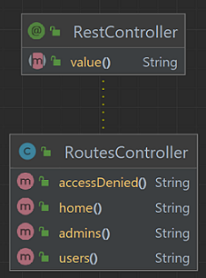

# Spring Security - Autenticador em memória
Projeto em Java com Spring e Gradle para autenticação básica em memória com autorização para rotas.

Diagrama de classes UML:

Rotas:
- `/`
- `/users` 
- `/admins`
- `/accessDenied`

## Passos
Os passos da implementação do projeto:

1. Criar projeto (no IntelliJ) com:
- Linguagem Java (17);
- Spring Framework (6.2.3);
- Dependências: Web e Security.

2. Criar a classe `RoutesController`:
- no pacote `controllers`;
- com a anotação `@RestController`;
- com as rotas `/`, `/users`, `/admins`, `/accessDenied` do tipo GET.

3. Criar a classe `SecurityConfig`:
- no pacote `security`;
- com as anotações `@Configuration` e `@EnableWebSecurity`;
- com todos os métodos anotados com `@Bean`;
- com os seguintes métodos públicos:
  - `SecurityFilterChain securityFilterChain(HttpSecurity http)` para configurar a autorização de cada rota;
  - `UserDetailsService userDetailsService()` para criar usuários;
  - `PasswordEncoder passwordEncoder()` para retornar uma instância de `BCryptPasswordEncoder`;
  - `AuthenticationManager authenticationManager(UserDetailsService UserDetailsService,
    PasswordEncoder passwordEncoder)` para personalizar o autenticador com passwordEncoder;

## Referências
https://docs.spring.io/spring-security/reference/servlet/authentication/passwords/index.html