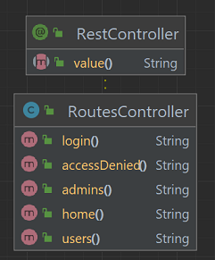

# Spring Security - In-memory Authenticator
Java project with Spring and Gradle for basic in-memory authentication with authorization for routes.

## Steps
The steps of project implementation:

1. Create project (in IntelliJ) with:
- Java language (17);
- Spring Framework (6.2.3);
- Dependencies: Web and Security.

2. Create the `RoutesController` class:
- with the annotation `@RestController`;
- with the `/login` route of type POST;
- with the routes `/, /users, /admins, /accessDenied` of type GET.

## References
https://docs.spring.io/spring-security/reference/servlet/authentication/passwords/index.html