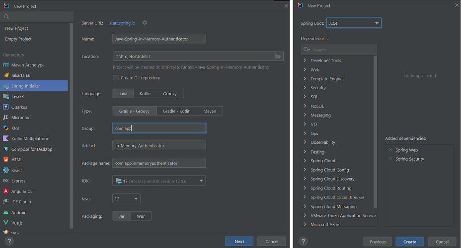

# Spring Security - In-memory Authenticator
Java project with Spring and Gradle for basic in-memory authentication with authorization for routes.

## Steps
The steps of project implementation:

1. Create project (in IntelliJ) with:
- Java language (17);
- Spring Framework (6.2.3);
- Dependencies: Web and Security.

## References
https://docs.spring.io/spring-security/reference/servlet/authentication/passwords/index.html