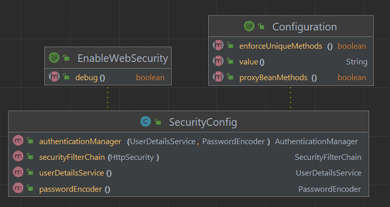

# Spring Security - In-memory Authenticator
Java project with Spring and Gradle for basic in-memory authentication with authorization for routes.

UML Class Diagram:

Routes:
- `/`
- `/users`
- `/admins`
- `/accessDenied`

## Steps
The steps of project implementation:

1. Create project (in IntelliJ) with:
- Java language (17);
- Spring Framework (6.2.3);
- Dependencies: Web and Security.

2. Create the `RoutesController` class:
- in the `controllers` package;
- with the annotation `@RestController`;
- with the routes `/`, `/users`, `/admins`, `/accessDenied` of type GET.

3. Create the `SecurityConfig` class:
- in the `security` package;
- with the annotations `@Configuration` and `@EnableWebSecurity`;
- with all methods annotated with `@Bean`;
- with the following public methods:
    - `SecurityFilterChain securityFilterChain(HttpSecurity http)` to configure authorization for each route;
    - `UserDetailsService userDetailsService()` to create users;
    - `PasswordEncoder passwordEncoder()` to return an instance of `BCryptPasswordEncoder`;
    - `AuthenticationManager authenticationManager(UserDetailsService UserDetailsService,
      PasswordEncoder passwordEncoder)` to customize the authenticator with passwordEncoder;

## References
https://docs.spring.io/spring-security/reference/servlet/authentication/passwords/index.html